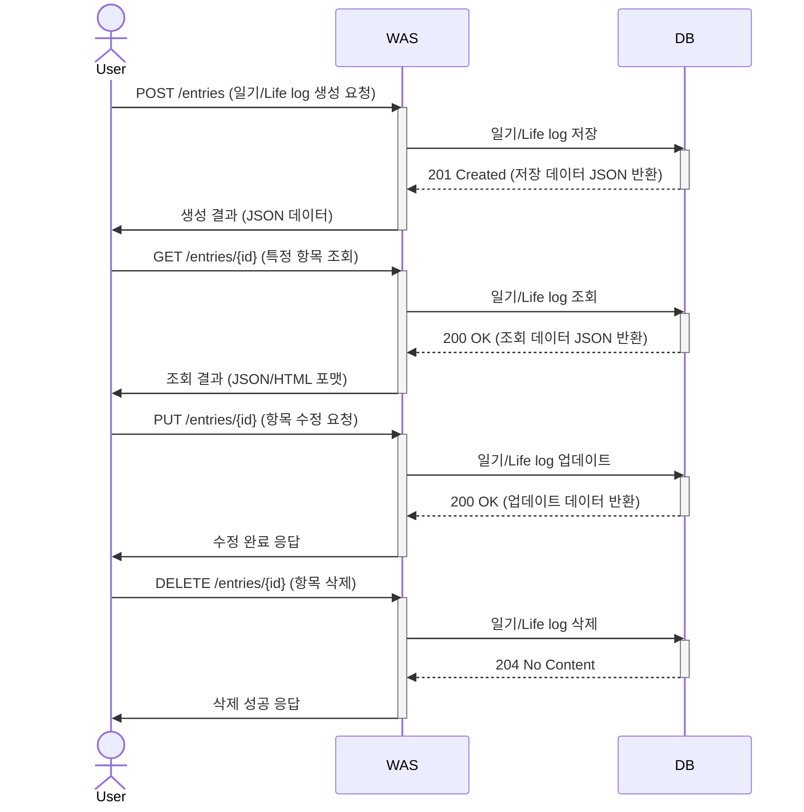
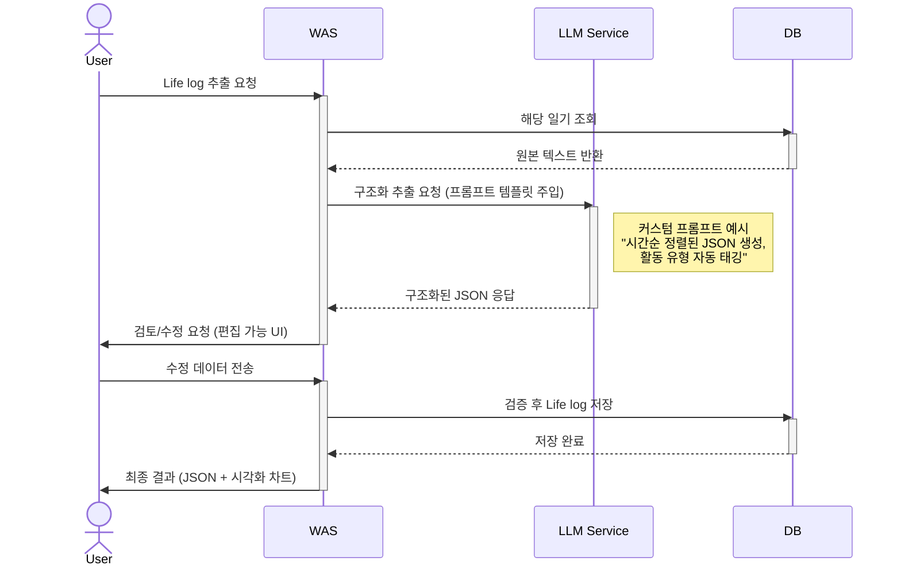
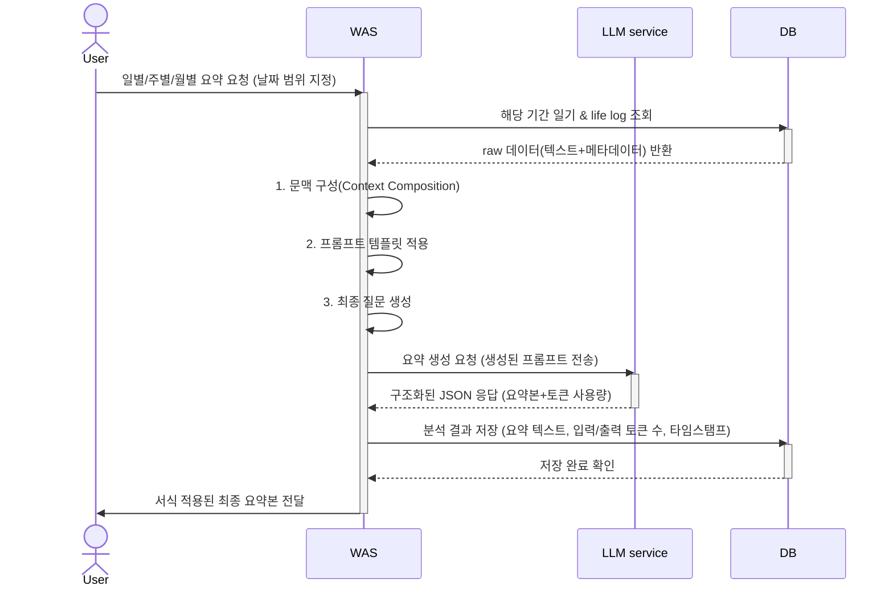

## SW / 시스템 구성도

## 시스템 구성도

서비스에 대한 UI는 Android 앱으로 구현합니다. 
사용자 요청에 대한 처리는 Spring Boot 기반의 WAS로 처리합니다.
데이터베이스는 PostgreSQL을 사용하며, 벡터 데이터베이스로는 PGVector를 사용합니다.
LLM 서비스는 OpenAI 혹은 Amazon Bedrock를 사용합니다.


### 일기 & life log 관련 요청 

기본적인 흐름은 Restapi 형태로 요청을 받고, db에 저장하고 반환합니다.

- **생성:**  
  사용자가 앱에서 일기나 life log를 작성하면, WAS가 입력값을 검증한 뒤 DB에 저장합니다. 저장이 완료되면 성공 메시지와 함께 생성된 데이터의 정보를 반환합니다.
- **조회:**  
  사용자가 특정 일기/로그를 조회하면, WAS가 DB에서 데이터를 읽어와 사용자에게 반환합니다.
- **수정:**  
  사용자가 기존 일기/로그를 수정하면, WAS가 해당 데이터를 DB에서 찾아 업데이트합니다. 수정 완료 후 결과를 반환합니다.
- **삭제:**  
  사용자가 일기/로그 삭제를 요청하면, WAS가 DB에서 해당 데이터를 삭제하고, 성공 응답을 반환합니다.



### 일기 내용을 기반으로 Life log 추출 요청

- 사용자가 life log 추출을 요청하면, WAS가 DB에서 원본 일기 데이터를 읽어와 LLM 서비스로 전송합니다.
- LLM이 일기 내용을 분석해 시간순으로 정리된 life log를 JSON으로 반환합니다.
- 사용자는 이 결과를 직접 확인 및 수정할 수 있으며, 최종적으로 DB에 저장됩니다.



### LLM 요약 서비스 요청

- 사용자가 특정 기간(일/주/월) 요약을 요청하면, WAS가 해당 기간의 데이터를 DB에서 조회합니다.
- WAS는 데이터를 정리하고, LLM 서비스에 요약을 요청합니다.
- LLM이 요약 결과를 반환하면, WAS는 이를 DB에 저장하고, 사용자는 앱에서 보기 쉽게 결과를 받습니다.



### LLM & RAG 기반 사용자 질의 응답 서비스

- 사용자가 자연어로 질문하면, WAS가 질문을 임베딩하여 Vector DB에서 관련 life log를 검색합니다.
- 검색된 정보를 바탕으로 LLM 서비스에 질의 응답을 요청하고, 필요시 함수 호출(예: 특정 기간 운동 기록 조회 등)도 자동으로 처리합니다.
- 최종적으로 사용자는 자연스러운 답변을 앱에서 확인할 수 있습니다.

sequenceDiagram
    actor User
    participant WAS
    participant LLM service
    participant Vector DB

    User ->> WAS: 자연어 질의 전송 (예: "지난주 운동 기록 알려줘")
    activate WAS

    WAS ->> WAS: 1. 사용자 질의 임베딩 생성
    WAS ->> Vector DB: Vector 기반 유사도 검색 (cosine similarity)
    activate Vector DB
    Vector DB -->> WAS: 관련 life log 컨텍스트 반환
    deactivate Vector DB

    WAS ->> WAS: 2. 다음 요소 결합
    Note right of WAS: - 검색된 컨텍스트<br>- 프리프롬프트 템플릿<br>- 호출 가능 함수 목록

    WAS ->> LLM service: 함수 호출 포함된 구조화된 요청
    activate LLM service
    LLM service -->> WAS: JSON 형식 응답 (답변 + 호출 함수)
    deactivate LLM service

    WAS ->> Vector DB: 필요 시 추가 데이터 조회 (함수 실행)
    activate Vector DB
    Vector DB -->> WAS: 함수 처리 결과 반환
    deactivate Vector DB

    WAS ->> User: 최종 응답 포맷팅 (마크다운/카드 UI)
    deactivate WAS
```

## 동작환경
사용자는 안드로이드 기반 모바일 앱을 통해서 서비스를 이용할 수 있습니다.
Spring framework 기반의 WAS 서버는 Docker 이미지로 가상화 되어 Amazon Ec2 인스턴스에서 동작합니다.
PostgreSQL 데이터베이스는 PGVector를 사용하여 Amazon RDS 인스턴스에서 동작합니다.