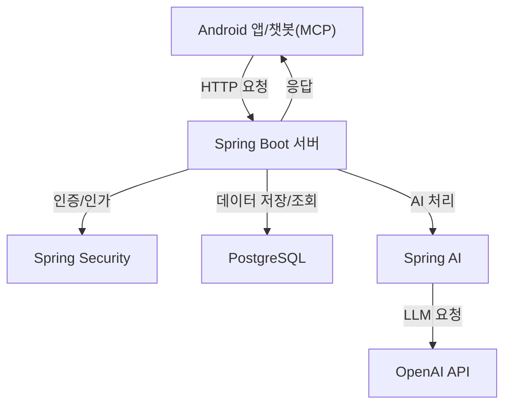

# A. 프로젝트 명

AI Life Log (AI 라이프로그)

# B. 프로젝트 멤버 이름 및 멤버 별 담당한 파트 소개

[멤버 정보와 역할을 추가해주세요]

# C. 프로젝트 소개

AI Life Log는 사용자의 일상 활동을 기록하고 분석하는 지능형 라이프로깅 시스템입니다. 사용자가 텍스트로 활동 일지를 축적하고, 이를 AI 기술을 활용하여 분석함으로써 사용자의 활동 패턴 및 일과를 파악하여 의미 있는 인사이트를 제공합니다.

# D. 프로젝트 필요성 소개

- 단순한 일정 기록을 넘어, AI와 LLM을 활용해 사용자의 라이프스타일을 심층적으로 분석하고, 자기 객관화와 건강한 습관 형성을 지원하는 것이 목표입니다.
- 바쁜 현대인의 일상 패턴을 자동으로 기록·분석하여 자기 성찰과 생산성 향상에 도움을 줍니다.
- 자연어 기반 챗봇 인터페이스로 누구나 쉽게 일상 기록 및 분석이 가능합니다.

# E. 관련 기술/논문/특허 조사 내용 소개

## 선행 기술 및 연구
- **Daylio 앱**: 기분 및 활동 태그 기반 일지 작성, 통계 차트, 텍스트 기반 심리 분석
- **관련 논문**: "Lifelog Retrieval From Daily Digital Data" (JMIR, 2022), 의미적 활동 검색, 멀티모달 데이터 통합 검색
- **특허**: EP2457207A1 – "Location-based information retrieval and analysis", 반복 활동 패턴 탐지, 텍스트 감정 및 웰니스 피드백 알고리즘

# F. 프로젝트 개발 결과물 소개 (+ 다이어그램)

## 주요 기능
1. 라이프로그 기록 (텍스트 기반)
2. AI 기반 패턴 분석 (일/주/월 단위)
3. fastmcp 기반 멀티채널 챗봇 연동 (명령어로 생성/조회/수정)

## 시스템 아키텍처 다이어그램


## 챗봇 명령어 예시
- 로그인: `login(username, password)`
- 라이프로그 생성: `create_log(title, description, timestamp)`
- 라이프로그 조회: `get_logs(page, size, from_date, to_date)`
- 라이프로그 수정: `update_log(log_id, title, description, timestamp)`

# G. 개발 결과물을 사용하는 방법 소개 (설치 방법, 동작 방법 등)

## 요구사항
- Java 17 이상
- Android Studio (앱 개발용)
- Python 3.11 이상 (fastmcp 서버용)
- PostgreSQL 데이터베이스
- OpenAI API 키
- Docker (배포용)

## 설치 및 실행 방법
1. 환경 변수 설정
```properties
OPENAI_API_KEY=your_api_key
SPRING_DATASOURCE_URL=your_database_url
SPRING_DATASOURCE_USERNAME=your_username
SPRING_DATASOURCE_PASSWORD=your_password
```
2. 의존성 설치 및 빌드 (Spring Boot)
```bash
./gradlew build
```
3. 애플리케이션 실행 (Spring Boot)
```bash
./gradlew bootRun
```
4. fastmcp 챗봇 서버 실행
```bash
cd fastmcp
pip install -r requirements.txt
python app.py
```

## 배포 환경
- WAS: Amazon EC2 (Docker 컨테이너)
- 데이터베이스: Amazon RDS (PostgreSQL)
- 모바일 앱: Android 플랫폼
- 챗봇 서버: 별도 Python 환경 또는 Docker 컨테이너

# H. 개발 결과물의 활용방안 소개

1. **개인 생활 관리**
   - 일상 활동 기록 및 패턴 분석
   - 시간 관리 효율화
   - 챗봇을 통한 손쉬운 기록/조회/분석
2. **전문가 상담 보조**
   - 상담사를 위한 객관적 데이터 제공
   - 생활 패턴 기반 맞춤형 상담
   - 심리 상태 추적 및 분석
3. **연구 및 분석**
   - 사용자 행동 패턴 연구
   - 생활 패턴과 웰빙의 상관관계 연구
4. **교육 분야**
   - 학습 활동 기록 및 분석
   - 생산성 향상을 위한 패턴 분석
   - 시간 관리 교육 자료로 활용
