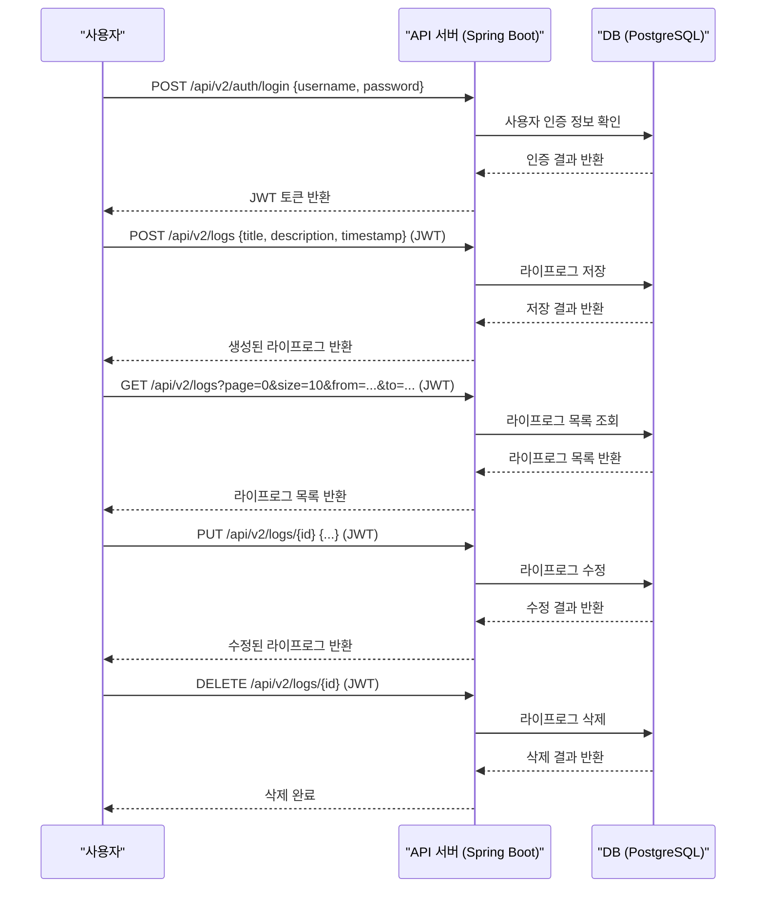
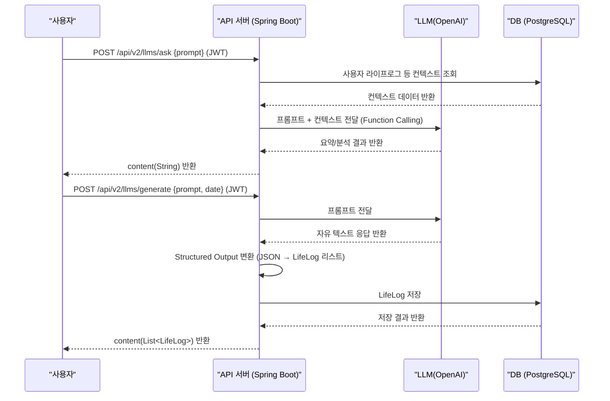
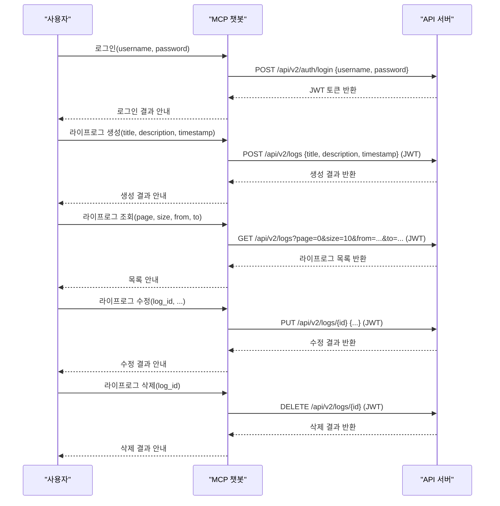

# AI Life-Log (AI 라이프로그)

# A. 프로젝트 명 (AI Life-Log)

## AI Life-Log (AI 라이프로그)


# B. 프로젝트 멤버 이름 및 멤버 별 담당한 파트 소개

## 팀원 정보

| 이름   | 역할   | 담당 파트 |
|--------|--------|-----------|
| 김기윤 | 개발   | 프론트엔드, 기획 |
| 이민형 | 개발   | 백엔드, MCP 챗봇 서버 |
| 문승권 | 발표/조사   | 기획, 조사, 발표 |
| 쿠사이노프 이스켄디르 | 개발   | AWS, Docker, 백엔드 |


## 팀원 역할 분담

### 김기윤 조원 담당 분야

1. **Android 앱 개발 총괄**
   - Jetpack Compose 기반 프론트엔드 앱 구조 설계 및 구현
   - 화면 간 네비게이션 구성
   - Hilt를 활용한 DI(의존성 주입), Retrofit/OkHttp3 기반 AWS 서버 연동
2. 사용자 인증, 회원가입, UIUX 등 주요 앱 기능 구현
   - 라이프로그 작성 기능 / UI 구현
   - 일기 생성 및 조회 기능 UI 구현
   - 서버 동기화 기능 구현
3. 디버깅 및 QA를 통한 사용자 경험 개선
   - 앱 초기 실행 시 자동로그인 및 SharedPreference로 사용자 상태 저장 처리
   - 디자인 요소 수정 및 유저플로우 개선
   - 사용자 피드백 반영을 위한 반응형 UI 구성

### 이민형 조원 담당 분야

1. **백엔드 총괄**
   - Spring Boot 기반 전체 API 서버 설계 및 구현
   - RESTful API(인증, 사용자, 라이프로그, LLM 등) 개발 및 테스트
   - JPA, JWT, Spring Security, OpenAI 연동 등 핵심 기능 개발
   - API 명세서 및 테스트 코드 작성

2. **MCP 챗봇 서버 개발**
   - fastmcp 기반 챗봇 서버(app.py) 설계 및 구현
   - 챗봇 명령어(tool) 설계 및 API 연동
   - Docker, 환경 변수, 배포 자동화 등 운영 환경 구축

3. **백엔드 전체 배포 및 운영 자동화**
   - Docker, docker-compose, 환경 변수 관리, 배포 스크립트 작성
   - 실 서비스 운영을 위한 운영 가이드 작성

### 문승권 조원 담당 분야

1. **프로젝트 기획 및 문서화**
   - AI Life-Log 프로젝트 아이디어 제시 및 기획화
   - 서비스 운영 및 디자인 제시
   - 유사 SW/시스템 기술 사전 조사
   - 관련 논문 및 특허 조사

3. **QA (Quality Assurance)**
   - 앱 UI/UX 구성 및 반복 테스팅
   - 개발 테스팅 및 구현 보조
   - Docker, 환경 변수 등의 운영 환경 보조

### 쿠사이노프 이스켄디르 조원 담당 분야

1. **백엔드 보조**
   - Docker, Docker-Compose 보조
   - 서비스 운용 보조 및 QA
   - JPA, JWT, Open AI 연동 및 핵심 기능 개발 보조
   - Dockerfile 및 DB 활용을 통한 백엔드 구현

2. **AWS & VM 환경 총괄**
   - AWS 배포 테스트 및 기능 구현
   - Android Studio를 통한 테스트 및 서버 주소 구현
   - VM 환경 제어 및 기능 구현


# C. 프로젝트 소개

AI Life Log는 사용자의 일상 활동을 기록하고 분석하는 지능형 라이프로깅 시스템입니다. 사용자가 텍스트로 활동 일지를 축적하고, 이를 AI 기술을 활용하여 분석함으로써 사용자의 활동 패턴 및 일과를 파악하여 의미 있는 인사이트를 제공합니다. 


# D. 프로젝트 필요성 소개

- 단순한 일정 기록을 넘어, AI와 LLM을 활용해 사용자의 라이프스타일을 심층적으로 분석하고, 자기 객관화와 건강한 습관 형성을 지원하는 것이 목표입니다.
- 바쁜 현대인의 일상 패턴을 자동으로 기록·분석하여 자기 성찰과 생산성 향상에 도움을 줍니다.
- 자연어 기반 챗봇 인터페이스로 누구나 쉽게 일상 기록 및 분석이 가능합니다.


# E. 관련 기술/논문/특허 조사 내용 소개

## 선행 기술 및 연구
- **Daylio 앱**
  - 기분 및 활동 태그 기반 일지 작성, 통계 차트, 텍스트 기반 심리 분석
  - CSV/JSON 내보내기 → 외부 ML 플랫폼과 연동해 사용자별 맞춤형 추천을 가능케 함.
  - 이러한 구조는 GPS 기반 라이프로그 서비스와 쉽게 통합할 수 있어, 기분 데이터와 위치/활동 데이터를 동시 모델링하려는 프로젝트에 좋은 레퍼런스가 된다.

- **관련 논문** :: "Lifelog Retrieval From Daily Digital Data" (JMIR, 2022), 의미적 활동 검색, 멀티모달 데이터 통합 검색
  - 일상 라이프로그(이미지, GPS, 웨어러블, 텍스트 노트)를 “의미 단위(activities, events, concepts)”로 인덱싱하여 의미 기반 검색(semantic retrieval) 을 가능케 하는 기술 동향을 정리.
  - 우리 GPS·텍스트 기반 일지에서도 쿼리-바이-예시 UI(“지난주 비슷한 패턴 찾기”)를 구현하면 사용자가 과거의 활동 루틴/감정 상태를 직관적으로 탐색할 수 있다.
  - 논문에서 제안한 RL-to-Rank 전략은 사용자 피드백 기반 맞춤 모델 구축에 유용하므로, MVP 단계부터 ‘좋아요/별표’ 입력을 설계하여 학습 파이프라인을 마련하는 것이 좋다.

- **특허** :: EP2457207A1 – "Location-based information retrieval and analysis", 반복 활동 패턴 탐지, 텍스트 감정 및 웰니스 피드백 알고리즘
  - 모바일 단말로부터 위치·시간·사용자 메모를 수집 → 서버 측 패턴 탐지 엔진이 반복 행동(예: 출근 루트, 저녁 운동)을 식별
  - “행동 인사이트(Behavioural Insights)”와 웰니스 피드백(스트레스 지수, 좌식 시간 경고 등)을 사용자에게 제공.
  - 본 특허는 2012 출원으로, 핵심 알고리즘(클러스터링·감정 추출)은 이미 공개기술 상태이다. 우리 서비스가 (a) 강화학습 기반 개인화 추천, (b) 프라이버시 보호 연산(온-디바이스 연산, 연합학습) 등을 추가하면 차별화 + 특허 회피 전략을 동시에 달성할 수 있다.
 


# F. 프로젝트 개발 결과물 소개 (+ 다이어그램)

## 시스템 구성

### 기술 스택

+ 백엔드: Spring Boot, PostgreSQL, OpenAI API
+ 프론트엔드: Android, Kotlin, Jetpack Compose UI ToolKit
+ 챗봇: fastmcp, OpenAI API
+ 데이터베이스: PostgreSQL
+ 클라우드: Amazon EC2, Amazon RDS


### 시스템 아키텍처 다이어그램


### 백엔드

+ 백엔드의 api server는 Spring Boot를 사용하여 개발되었습니다. 기본적인 사용자와, 사용자의 lifelog를 추가, 조회, 수정, 삭제하는 기능을 restful하게 제공합니다. 
+ jwt 토큰을 통해 회원가입과 로그인과 같은 인증을 구현하였고, jpa를 통해 데이터베이스와 연동하였습니다.
+ Spring AI 프레임워크를 통해 OPENAI 서비스와 연동하고 template, function calling, structured output과 같은 부가적인 기능 개발에 활용하였습니다.

### MCP Client 서버

+ fastmcp를 통해 로컬환경에서 실행되는 sse 기반 챗봇 서버를 구현하였습니다.
+ agent에게 제공하는 기능은 login, create_log, get_logs, update_log 입니다. 
+ 먼저 로그인 후, agent의 재량에 따라 라이프로그를 생성하거나, 라이프로그를 조회하거나, 라이프로그를 수정할 수 있습니다.

### 프론트엔드

+ Android Native Application으로 개발하였습니다.
+ 사용자가 라이프로그를 생성, 조회, 수정, 삭제할 수 있는 직관적인 UI를 제공합니다.
+ Jetpack Compose를 활용하여 화면을 구성하였으며, Hilt를 이용한 의존성 주입(DI) 구조로 개발되었습니다.
+ 사용자 인증(회원가입/로그인) 후에는 발급받은 JWT 토큰을 SharedPreference에 저장하고, 이를 통해 저장해 둔 AccessToken을 Header애 태워 서버에 전달합니다.
+ Retrofit을 사용하여 RESTful API 서버와 통신하며, LLM 기반 분석/생성 기능도 UI에서 쉽게 접근할 수 있도록 구현하였습니다.

## 주요 기능 - Frontend
+ 주요 화면 구성
    - 회원가입 및 로그인 화면
        - 사용자로부터 ID와 비밀번호를 입력받아 서버에 전달
        - 로그인 성공 시 JWT 토큰을 로컬에 저장하고 메인 화면으로 이동
    - 라이프로그 목록 화면
        - 서버로부터 전체 또는 기간별 라이프로그 목록을 불러와 표시
        - LazyColumn 형식으로 구성되며, 페이징 처리(paging 기능) 포함
    - 라이프로그 생성/수정 화면
        - 텍스트 입력을 통해 라이프로그를 작성
        - 기존 로그를 수정할 때는 동일한 UI에서 데이터를 불러와 편집 가능
    - 라이프로그 AI 분석 화면
        - 작성했던 로그를 활용하여, LLM에게 요약, 정리 등 다양한 요청 가능
        - LLM 분석 결과(예: 요약, 감정 분석 등) 표시
### UI 기술 구성

| 기술 스택       | 설명 |
|----------------|------|
| Jetpack Compose | 선언형 UI 구성으로 동적 상태 반영 |
| Hilt            | DI 구성으로 ViewModel 및 Repository 주입 |
| Retrofit        | REST API 연동 |
| Navigation      | Compose Navigation으로 화면 간 이동 관리 |
| SharedPreference| JWT 토큰 저장 및 인증 상태 유지 |
## 주요 기능 - Backend

### API 명세서

- [인증 API 명세서](../../BE/AI-Life-Log-v2/Documents/API/Auth.md)
- [라이프로그 API 명세서](../../BE/AI-Life-Log-v2/Documents/API/LifeLog.md)
- [LLM API 명세서](../../BE/AI-Life-Log-v2/Documents/API/LLM.md)
- [사용자 API 명세서](../../BE/AI-Life-Log-v2/Documents/API/User.md)


### 기능 흐름 Sequence Diagram

#### 기본적인 lifelog 생성, 조회, 수정, 삭제 기능



#### llm을 통한 라이프로그 분석 & 생성 기능



> function calling 기능을 통해 요약할 lifelog의 범위를 사용자 입력의 context 기반으로 추출가능하도록 구현하고,
> structured output 기능을 통해 라이프로그 출력을 원하는 방식으로 구조화 화고 object 형태로 반환하도록 구현하였습니다.


### mcp 기반 챗봇 연동



> sse 기반 챗봇 서버를 통해 사용자의 요청을 받아 백엔드 api 서버와 연동하여 처리하는 기능을 구현하였습니다.


# G. 개발 결과물을 사용하는 방법 소개 (설치 방법, 동작 방법 등)


## 프론트 엔드  안드로이드 앱 실행 방법

### 1. 개발 환경
- **Android Studio Ladybug 2024.2.1 Patch 3**
- Kotlin 2.0.20 이상
- Gradle 8.x
- Android SDK 34 이상
- Java 11
- Windows 11

### 2. 실행 방법
1. 본 레포지토리의 FE 디렉토리를 Android Studio로 프로젝트 오픈.
2. `build.gradle.kts` 및 `settings.gradle.kts` sync.
3. 실제 기기(Android 모바일 디바이스) 유선 연결 또는 IDE 내 탑재된 Android 에뮬레이터 설정
4. `app` 모듈을 선택하고 **Run** 실행 (Shift + F10)
5. 아이디/비밀번호로 회원 가입 후 라이프로그 작성
6. 앱을 종료 및 재실행 시 토큰이 유효하다면 자동 로그인, 아닐 시 로그인 페이지로 이동

### 3. 주요 기능
- 회원가입 / 로그인 (JWT 기반)
- 라이프로그 생성 / 삭제 / 조회
- GPT 기반 분석 / 생성 기능 호출

## Backend 배포 환경 구성 및 실행 방법

### Spring Boot API Server 실행 방법

+ 위치: [BE/AI-Life-Log-v2/](../../BE/AI-Life-Log-v2/)

### 요구사항
- Java 17 이상
- Android Studio (앱 개발용)
- Python 3.11 이상 (fastmcp 서버용)
- PostgreSQL 데이터베이스
- OpenAI API 키
- Docker (배포용)

### 로컬에서 실행하는 방법

1. 환경 변수 설정

```properties
OPENAI_API_KEY=your_api_key
SPRING_DATASOURCE_URL=your_database_url
SPRING_DATASOURCE_USERNAME=your_username
SPRING_DATASOURCE_PASSWORD=your_password
```

2. 의존성 설치 및 빌드 (Spring Boot)

```bash
./gradlew build
```

3. 애플리케이션 실행 (Spring Boot)

```bash
./gradlew bootRun
```

### Docker-compose 를 통한 실행 방법

1. `.env` 파일 생성 및 환경 변수 설정

```properties
SERVER_PORT=8080
OPENAI_API_KEY=sk-???
DB_URL=jdbc:postgresql://your-host:your-port/your-database
DB_USER=postgres
DB_PASSWORD=your-password
JWT_SECRET=???
```

2. 빌드 및 실행


```bash
docker-compose up --build
```
> 데이터베이스와 함께 서버가 실행됩니다. 

## mcp 기반 챗봇 서버 실행 방법

+ 위치: [BE/AI-Life-Log-v2/fastmcp/](../../BE/AI-Life-Log-v2/fastmcp/)

### 1. 가상 Python 환경 생성 및 의존성 설치

```bash
python -m venv .venv
# Windows
.venv\Scripts\activate
# macOS/Linux
source .venv/bin/activate
pip install --upgrade pip
pip install -r requirements.txt
```

### 2. 환경 변수 설정 또는 `.env` 파일 생성

- `.env` 파일 예시:
```properties
APPLICATION_URL=http://localhost:8080
HOST=0.0.0.0
PORT=8000
CURSOR_ENABLED=true
CURSOR_URL=http://localhost:8000
```
- 또는 환경변수로 직접 지정 가능

### 3. 서버 실행

```bash
python app.py
```
- 기본적으로 8000번 포트에서 SSE 기반으로 실행됩니다.
- Windows 환경에서는 내부적으로 asyncio 설정이 자동 적용됩니다.

### 4. Docker로 실행 (선택)

```bash
docker build -t fastmcp .
docker run -p 8000:8000 --env-file .env fastmcp
```
- Docker 환경에서도 `.env` 파일을 활용할 수 있습니다.

---

### 사용 방법

#### 1. Cursor 등 외부 툴 연동

- 예시 (Cursor 환경):
```json
mcp {
    "name": "ai-life-log-mcp",
    "url": "http://localhost:8000/mcp"
}
```
- Cursor의 settings > mcp 탭에서 위와 같이 등록

#### 2. 챗봇 명령어 예시

- 로그인: `login(username, password)`
- 라이프로그 생성: `create_log(title, description, timestamp)`
- 라이프로그 조회: `get_logs(page, size, from_date, to_date)`
- 라이프로그 수정: `update_log(log_id, title, description, timestamp)`

#### 3. 서버 종료

- 가상환경 비활성화:  
  - Windows: `deactivate`  
  - macOS/Linux: `deactivate`

---

### 실전 사용 예시

1. 서버 실행 후, Cursor에서 MCP 연결 설정을 추가합니다.
2. 챗봇에게 "login", "create_log", "get_logs" 등 명령어를 자연어로 입력해 라이프로그를 관리할 수 있습니다.
3. 서버 로그와 챗봇 응답을 통해 정상 동작을 확인하세요.

> 포트 충돌, 환경 변수 누락 등 오류가 발생하면 설정을 다시 확인하세요.


# H. 개발 결과물의 활용방안 소개

1. **개인 생활 관리**
   - 일상 활동 기록 및 패턴 분석
   - 시간 관리 효율화
   - 챗봇을 통한 손쉬운 기록/조회/분석

2. **전문가 상담 보조**
   - 상담사를 위한 객관적 데이터 제공
   - 생활 패턴 기반 맞춤형 상담
   - 심리 상태 추적 및 분석

3. **연구 및 분석**
   - 사용자의 행동 패턴 연구 및 기록화
   - 생활 패턴과 웰빙의 상관관계 연구

4. **교육 분야**
   - 학습 활동 기록 및 분석
   - 생산성 향상을 위한 패턴 분석
   - 시간 관리 교육 자료로 활용
