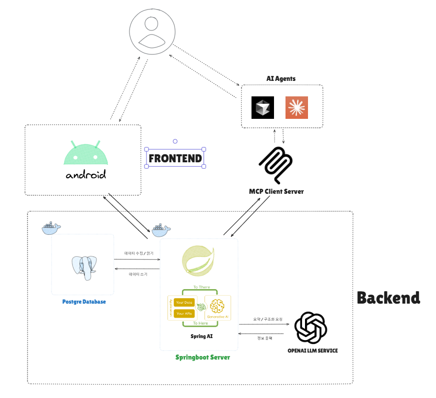
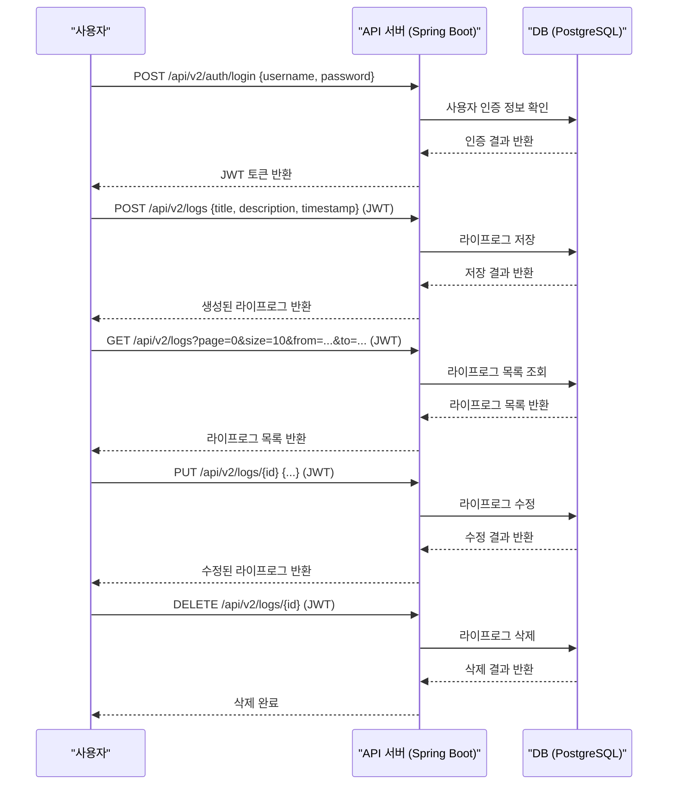
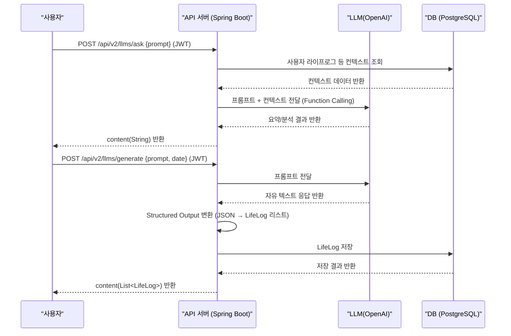
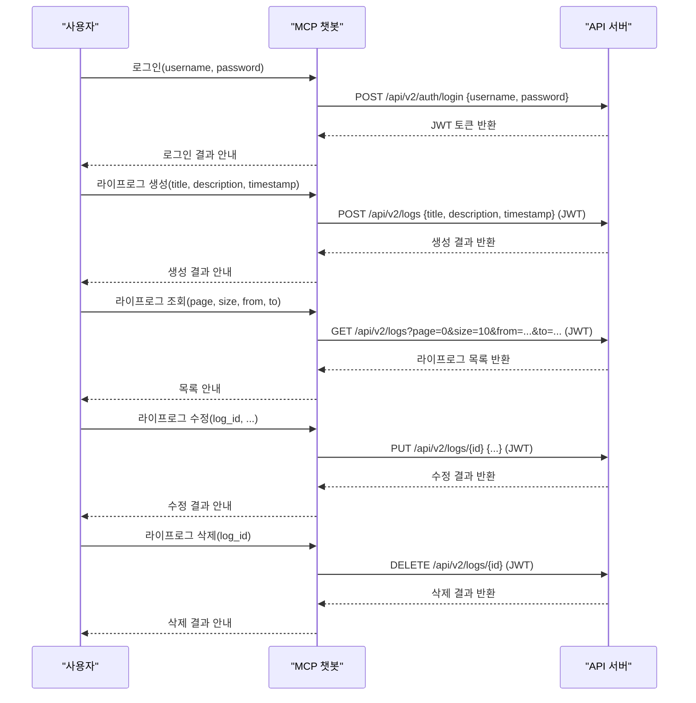

# F. 프로젝트 개발 결과물 소개 (+ 다이어그램)

## 시스템 구성

### 기술 스택

+ 백엔드: Spring Boot, PostgreSQL, OpenAI API
+ 프론트엔드: Android, Kotlin, Jetpack Compose UI ToolKit
+ 챗봇: fastmcp, OpenAI API
+ 데이터베이스: PostgreSQL
+ 클라우드: Amazon EC2, Amazon RDS

### 시스템 아키텍처 다이어그램

### 백엔드

+ 백엔드의 api server는 Spring Boot를 사용하여 개발되었습니다. 기본적인 사용자와, 사용자의 lifelog를 추가, 조회, 수정, 삭제하는 기능을 restful하게 제공합니다. 
+ jwt 토큰을 통해 회원가입과 로그인과 같은 인증을 구현하였고, jpa를 통해 데이터베이스와 연동하였습니다.
+ Spring AI 프레임워크를 통해 OPENAI 서비스와 연동하고 template, function calling, structured output과 같은 부가적인 기능 개발에 활용하였습니다.

### MCP Client 서버

+ fastmcp를 통해 로컬환경에서 실행되는 sse 기반 챗봇 서버를 구현하였습니다.
+ agent에게 제공하는 기능은 login, create_log, get_logs, update_log 입니다. 
+ 먼저 로그인 후, agent의 재량에 따라 라이프로그를 생성하거나, 라이프로그를 조회하거나, 라이프로그를 수정할 수 있습니다.

### 프론트엔드

+ Android Native Application으로 개발하였습니다.
+ 사용자가 라이프로그를 생성, 조회, 수정, 삭제할 수 있는 직관적인 UI를 제공합니다.
+ Jetpack Compose를 활용하여 화면을 구성하였으며, Hilt를 이용한 의존성 주입(DI) 구조로 개발되었습니다.
+ 사용자 인증(회원가입/로그인) 후에는 발급받은 JWT 토큰을 SharedPreference에 저장하고, 이를 통해 저장해 둔 AccessToken을 Header애 태워 서버에 전달합니다.
+ Retrofit을 사용하여 RESTful API 서버와 통신하며, LLM 기반 분석/생성 기능도 UI에서 쉽게 접근할 수 있도록 구현하였습니다.

## 주요 기능 - Frontend
+ 주요 화면 구성
    - 회원가입 및 로그인 화면
        - 사용자로부터 ID와 비밀번호를 입력받아 서버에 전달
        - 로그인 성공 시 JWT 토큰을 로컬에 저장하고 메인 화면으로 이동
    - 라이프로그 목록 화면
        - 서버로부터 전체 또는 기간별 라이프로그 목록을 불러와 표시
        - LazyColumn 형식으로 구성되며, 페이징 처리(paging 기능) 포함
    - 라이프로그 생성/수정 화면
        - 텍스트 입력을 통해 라이프로그를 작성
        - 기존 로그를 수정할 때는 동일한 UI에서 데이터를 불러와 편집 가능
    - 라이프로그 AI 분석 화면
        - 작성했던 로그를 활용하여, LLM에게 요약, 정리 등 다양한 요청 가능
        - LLM 분석 결과(예: 요약, 감정 분석 등) 표시
### UI 기술 구성

| 기술 스택       | 설명 |
|----------------|------|
| Jetpack Compose | 선언형 UI 구성으로 동적 상태 반영 |
| Hilt            | DI 구성으로 ViewModel 및 Repository 주입 |
| Retrofit        | REST API 연동 |
| Navigation      | Compose Navigation으로 화면 간 이동 관리 |
| SharedPreference| JWT 토큰 저장 및 인증 상태 유지 |
## 주요 기능 - Backend

### API 명세서

- [인증 API 명세서](../../BE/AI-Life-Log-v2/Documents/API/Auth.md)
- [라이프로그 API 명세서](../../BE/AI-Life-Log-v2/Documents/API/LifeLog.md)
- [LLM API 명세서](../../BE/AI-Life-Log-v2/Documents/API/LLM.md)
- [사용자 API 명세서](../../BE/AI-Life-Log-v2/Documents/API/User.md)

### 기능 흐름 Sequence Diagram

#### 기본적인 lifelog 생성, 조회, 수정, 삭제 기능

#### llm을 통한 라이프로그 분석 & 생성 기능

> function calling 기능을 통해 요약할 lifelog의 범위를 사용자 입력의 context 기반으로 추출가능하도록 구현하고,
> structured output 기능을 통해 라이프로그 출력을 원하는 방식으로 구조화 화고 object 형태로 반환하도록 구현하였습니다.

### mcp 기반 챗봇 연동

> sse 기반 챗봇 서버를 통해 사용자의 요청을 받아 백엔드 api 서버와 연동하여 처리하는 기능을 구현하였습니다.

## 결과 화면

[작성 필요]

