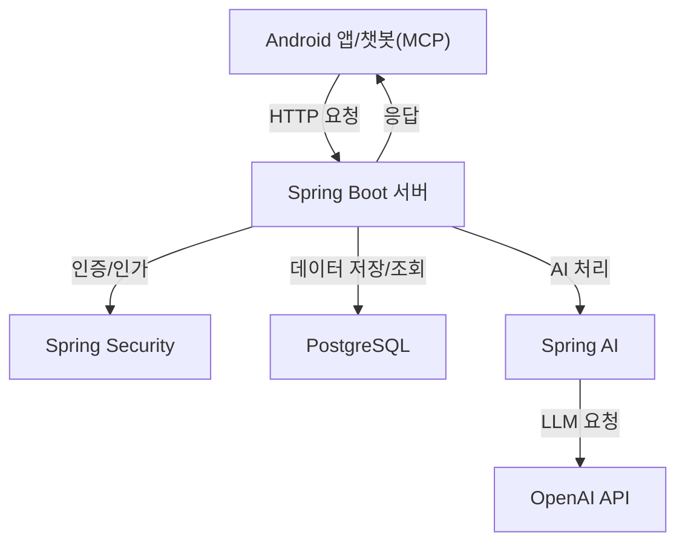

# F. 프로젝트 개발 결과물 소개 (+ 다이어그램)

## 주요 기능
1. 라이프로그 기록 (텍스트 기반)
2. AI 기반 패턴 분석 (일/주/월 단위)
3. fastmcp 기반 멀티채널 챗봇 연동 (명령어로 생성/조회/수정)

## 시스템 아키텍처 다이어그램

## 챗봇 명령어 예시
- 로그인: `login(username, password)`
- 라이프로그 생성: `create_log(title, description, timestamp)`
- 라이프로그 조회: `get_logs(page, size, from_date, to_date)`
- 라이프로그 수정: `update_log(log_id, title, description, timestamp)` 